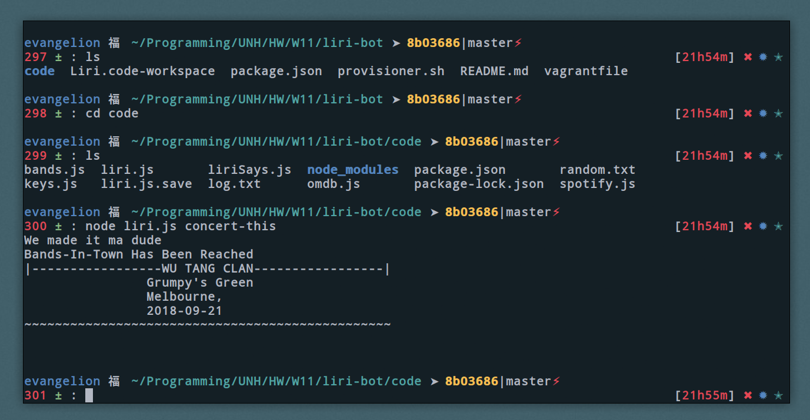

# Liri-Bot
> Liri bot is a language interpretation,& recognition interface Similiar to services like Apples Siri, or Googles Google-Assistance. 

> Liri is a node.js application that can be used with in the a command line interface. Liri takes in four different parameters, and retrieves relevent data to those paramaters
## Parameter Examples:
`spotify-this-song` :: To search spotify for a specified song
`concert-this` :: To search Band-in-town for an artists new events
`movie-this` :: To search OMDB for a specified movie title
`do-what-it-says` :: to the random.txt file, and do what it says.

## Used Technologies
* Node.js
* Javascript
* Command-line Interface (i.e Bash, ZSH, CSH, gitBash)
* Spotify API
* Bands-in-town API
* OMDB API
* # NPM - Installs
*  node-spotify-api
*  bandsintown-events
*  dotenv
*  moment.js
*  Request

# Created By
## Jake Plaisted - 2018